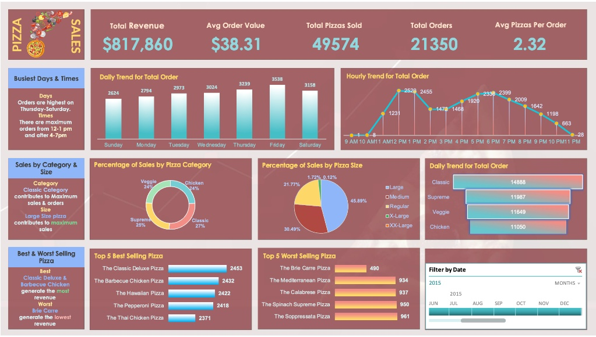

# 🍕 Pizza Sales Analysis Dashboard

An end-to-end Data Analytics project focused on uncovering key business insights from pizza sales transactions. This project involves **SQL-based Data Analysis** and an interactive **Excel Dashboard** to visualize sales trends, product performance, and customer ordering patterns.


<p align="center">
  
</p>

---

## 🎯 Project Objectives

The primary goal is to transform raw pizza sales data into actionable business intelligence by:
* **Analyzing Sales Trends:** Identifying peak days and hours for orders.
* **Product Performance:** Evaluating best and worst selling pizzas.
* **Category & Size Analysis:** Understanding which pizza categories and sizes drive revenue.
* **KPI Tracking:** Monitoring Total Revenue, Orders, Avg Order Value, and more.
* **Data Visualization:** Building an interactive Excel dashboard for stakeholders.

---

## 🧠 Dataset Overview

The dataset consists of pizza sales transactions with **12 features**, capturing detailed order information.

* **Features:** Order details, Pizza info, Pricing, Category, Size, and Ingredients.
* **Scope:** Full year of sales data (2015).

---

## 🛠️ Tools & Technologies

* **Database:** MySQL (for data extraction, aggregation & analysis)
* **BI Tool:** Microsoft Excel (Pivot Tables, Charts, Timeline Slicer)

---

## 🗃️ Dataset Columns

| Column | Data Type | Description |
|---|---|---|
| `pizza_id` | int | Unique pizza record identifier |
| `order_id` | int | Unique order identifier |
| `pizza_name_id` | text | Short code/slug for the pizza |
| `quantity` | int | Number of pizzas ordered |
| `order_date` | date | Date of the order |
| `order_time` | time | Time of the order |
| `unit_price` | double | Price per pizza |
| `total_price` | double | Total price for the order |
| `pizza_size` | text | Size (S, M, L, XL, XXL) |
| `pizza_category` | text | Category (Classic, Supreme, Veggie, Chicken) |
| `pizza_ingredients` | text | List of ingredients |
| `pizza_name` | text | Full name of the pizza |

---

## 🧹 Data Analysis (SQL)

Key queries used in this project:
1. **KPI Metrics** — Total Revenue, Total Orders, Total Pizzas Sold, Avg Order Value, Avg Pizzas Per Order
2. **Daily Trends** — Total orders grouped by day of the week
3. **Hourly Trends** — Total orders grouped by hour of the day
4. **Category Analysis** — Sales percentage by pizza category
5. **Size Analysis** — Sales percentage by pizza size
6. **Top & Bottom 5** — Best and worst selling pizzas by quantity

---

## 📊 Excel Dashboard

**Key Visualizations:**
* KPI Cards — Quick overview of key business metrics
* Daily Trend Chart — Orders by day of the week
* Hourly Trend Chart — Orders by hour of the day
* Category & Size Charts — Sales distribution (Donut & Pie)
* Category Bar Chart — Total orders by pizza category
* Best & Worst Sellers — Top 5 rankings
* Timeline Slicer — Interactive date filter

---

## 📈 Key Insights

* 💰 **Revenue:** Total revenue of **$817,860** generated from 21,350 orders.
* 🍕 **Top Category:** Classic pizzas lead with **27%** of total sales.
* 📏 **Top Size:** Large pizzas dominate with **45.89%** of total sales.
* 📅 **Peak Days:** Orders are highest on **Thursday–Saturday**.
* ⏰ **Peak Hours:** Busiest times are **12–1 PM** and **4–7 PM**.
* 🏆 **Best Sellers:** Classic Deluxe & Barbecue Chicken generate the most revenue.
* 📉 **Worst Seller:** Brie Carre Pizza has the lowest sales.

---

## 📦 Installation & Setup

### 1️⃣ Clone the Repository
```bash
git clone https://github.com/your-username/pizza-sales-analysis.git
cd pizza-sales-analysis
```

### 2️⃣ Run SQL Queries
Import `pizza_sales.csv` into MySQL and run the queries from `pizza_sales_queries.sql`.

### 3️⃣ Open Excel Dashboard
Open `pizza_sales.xlsx` and use the **Timeline Slicer** to filter by date.

---

## 📂 Project Structure
```text
credit-risk-analysis/
├── images/
│   └──── dashboard.jpeg
├── csv_file/
│   └──── pizza_sales.csv
├── pdf_documents/
│   └── Pizza Sales SQL Queries.pdf
├── sql_file/
│   └── pizza_sales.sql
├── excel_file/
│   └── pizza_sales.xlsx
└── README.md

---

## 📌 Business Recommendations

1. **Staffing:** Increase staff on Thursday–Saturday and during 12–1 PM & 4–7 PM rush hours.
2. **Promotion:** Focus marketing on Classic and Large size pizzas as top revenue drivers.
3. **Menu Review:** Consider revamping or removing consistently low-selling pizzas like Brie Carre.
4. **Upselling:** Promote Supreme and Veggie categories to diversify revenue streams.

---

## 👤 Author
**Mehedi Hasan**
* 🔗 Kaggle: [https://www.kaggle.com/mehedi71](https://www.kaggle.com/mehedi71)
* 🔗 LinkedIn: [https://www.linkedin.com/in/mehedi-hasan-094855388/](https://www.linkedin.com/in/mehedi-hasan-094855388/)